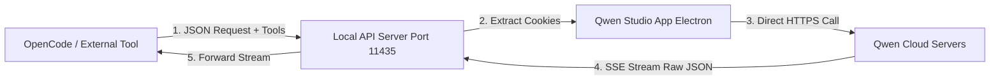

# Qwen Studio API Bridge Architecture

## Visual Workflow

## How it works step-by-step:

1. **The Trigger:** OpenCode sends a standard OpenAI-style JSON to `localhost:11435`.
2. **The Identity Theft:** Our bridge reaches into the running Qwen Studio app, grabs your **session cookies** (your login proof), and uses them.
3. **The Bypass:** Instead of typing into the UI box, the bridge sends a **direct network request** to `chat.qwen.ai` using those cookies. It looks exactly like the real app talking to the server.
4. **The Tool Injection:** If OpenCode sends tool definitions (like "read file"), our bridge shoves them into the JSON payload before sending it to Qwen.
5. **The Return:** Qwen sends back a stream of data. Our bridge pipes it directly back to OpenCode.

## Why this will work:

*   **Proven Concept:** We already proved that Qwen's server accepts these tool definitions. When we used the "Fetch Hook" earlier, Qwen successfully called the `web_search` tool.
*   **Identical Payloads:** We are now sending the **exact same JSON structure** that the official desktop app sends. To Qwen's servers, our bridge *is* the desktop app.
*   **No UI Bottleneck:** By bypassing the UI, we remove the slowness and fragility of DOM scraping. The response will be as fast as a normal API call.
