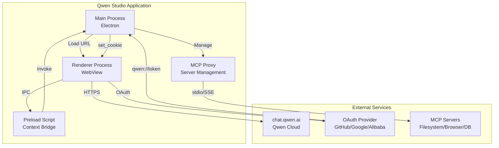
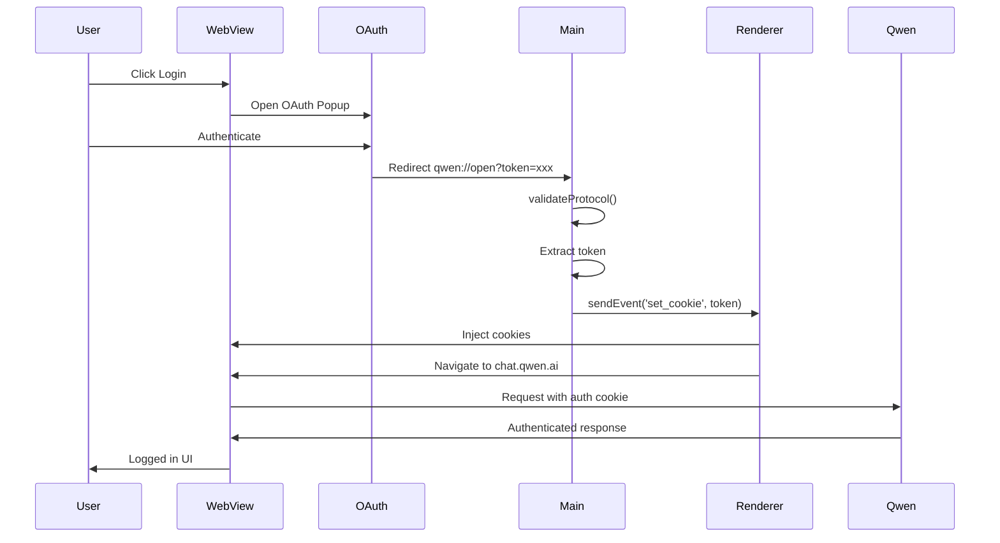
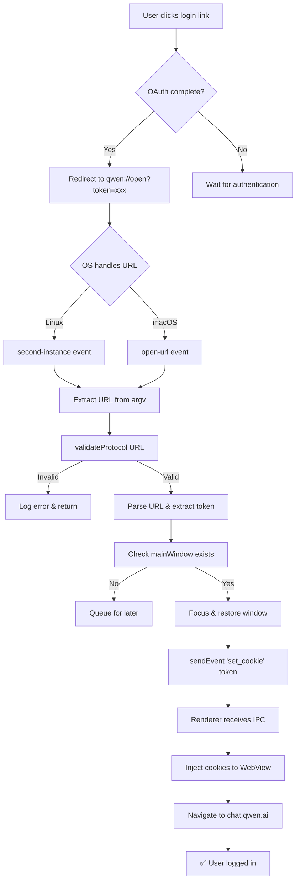
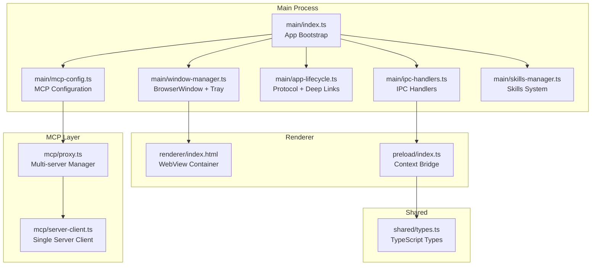
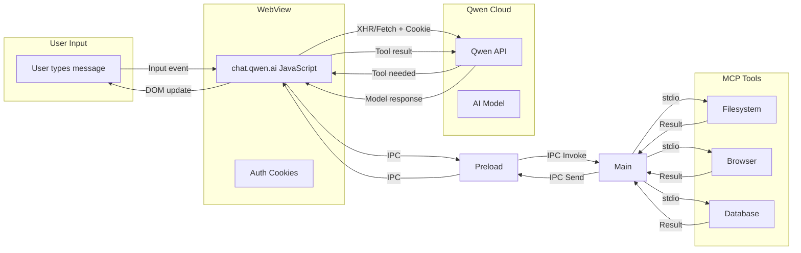
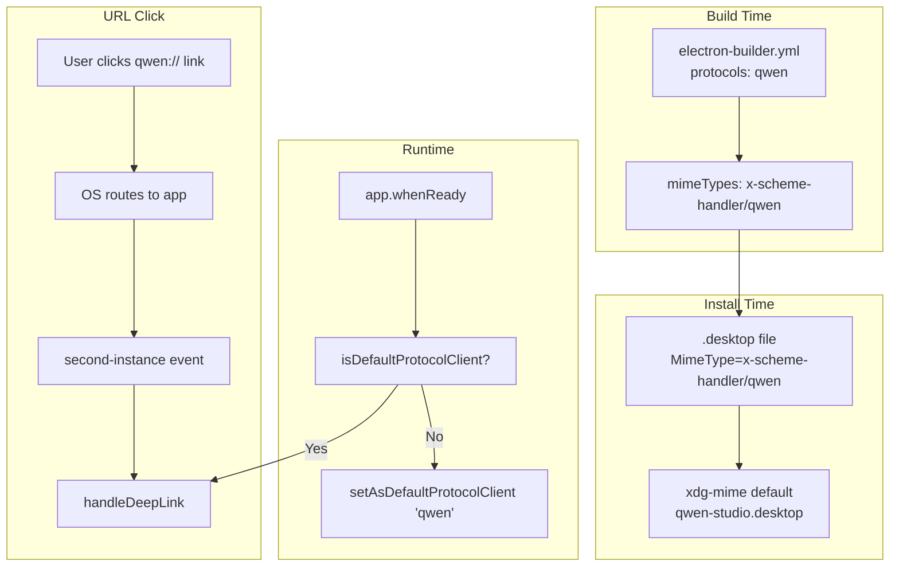
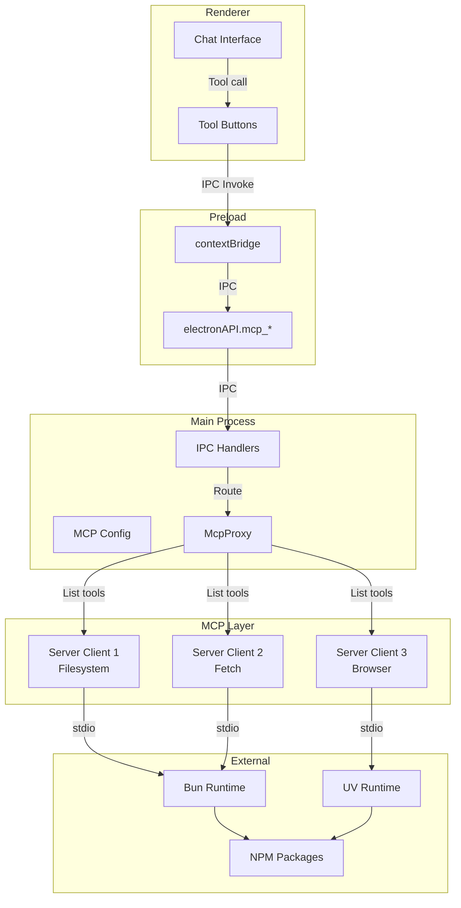
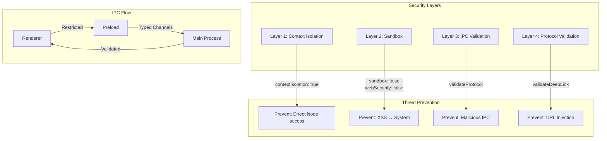

# Qwen Studio Architecture

## Overview

Qwen Studio is an Electron-based desktop client for Qwen AI (chat.qwen.ai) built for Linux. It wraps the web application with native features including system tray, MCP integration, deep linking, and custom protocol handling.

---

## System Architecture



---

## Authentication Flow



---

## Deep Link Handling



---

## Component Structure



---

## Data Flow



---

## Protocol Handler Registration



---

## MCP Server Architecture



---

## Security Model



---

## File Structure

```
qwen-studio/
├── src/
│   ├── main/
│   │   ├── index.ts              # App bootstrap
│   │   ├── window-manager.ts     # BrowserWindow + Tray
│   │   ├── ipc-handlers.ts       # IPC main handlers
│   │   ├── app-lifecycle.ts      # Protocol + Deep links
│   │   ├── mcp-config.ts         # MCP configuration
│   │   ├── skills-manager.ts     # Skills system
│   │   ├── runtime.ts            # Runtime paths
│   │   ├── logger.ts             # Logging utility
│   │   └── updater.ts            # Auto-updater
│   ├── mcp/
│   │   ├── proxy.ts              # Multi-server manager
│   │   └── server-client.ts      # Single server client
│   ├── preload/
│   │   └── index.ts              # Context bridge
│   ├── renderer/
│   │   └── index.html            # WebView container
│   └── shared/
│       └── types.ts              # TypeScript types
├── resources/
│   ├── bun/                      # Bundled Bun runtime
│   ├── uv/                       # Bundled UV runtime
│   └── icon.png                  # App icon
├── out/                          # Compiled JavaScript
├── dist/                         # Built packages
├── package.json
├── electron-builder.yml
└── tsconfig.json
```

---

## Key Technologies

| Component | Technology | Purpose |
|-----------|-----------|---------|
| **Framework** | Electron 34 | Desktop app framework |
| **Language** | TypeScript 5.7 | Type-safe JavaScript |
| **WebView** | Chromium | chat.qwen.ai rendering |
| **MCP** | @modelcontextprotocol/sdk | Tool integration |
| **Runtimes** | Bun + UV | MCP server execution |
| **Packaging** | electron-builder | AppImage, DEB, RPM |
| **Settings** | electron-settings | User preferences |
| **i18n** | i18next | 12 language support |

---

## Platform Support

| Platform | Package | Protocol Handler |
|----------|---------|-----------------|
| **All Linux** | AppImage | electron-builder + runtime |
| **Debian/Ubuntu** | DEB | MIME type + .desktop |
| **Fedora/RHEL** | RPM | MIME type + .desktop |
| **macOS** | DMG | Info.plist + open-url |
| **Windows** | EXE/MSI | Registry + second-instance |

---

## Version History

### v2.0.0 (2026-05-12) - Major Authentication Fix
- ✅ Fixed login flow (OAuth → qwen:// → token → cookie)
- ✅ Added runtime protocol registration
- ✅ Implemented Windows/macOS auth pattern
- ✅ Changed event: `auth_token` → `set_cookie`
- ✅ In-app OAuth popup (not external browser)
- ✅ Shared session between windows

### v1.1.3 and earlier
- Initial Linux release
- Basic Electron wrapper
- MCP support
- System tray

---

**Last Updated:** 2026-05-12  
**Version:** 2.0.0
