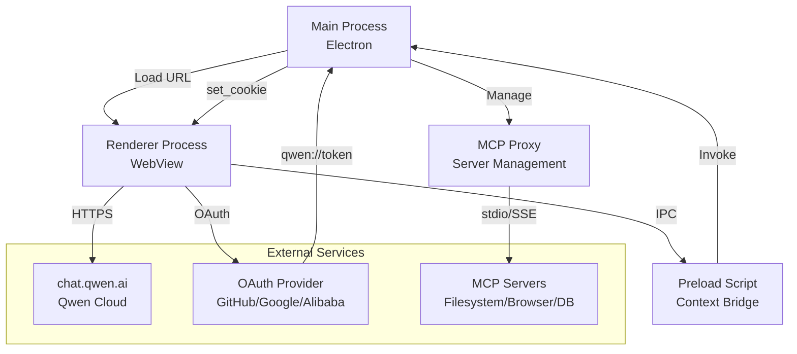
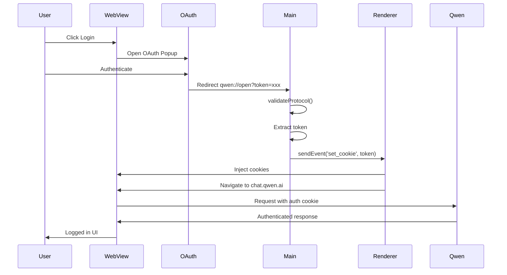

# Qwen Studio for Linux

[](https://github.com/youssefvdel/qwen-studio/releases)
[](LICENSE)
[](https://github.com/youssefvdel/qwen-studio/releases)
[](https://github.com/youssefvdel/qwen-studio/stargazers)

Open-source Qwen AI (Tongyi Qianwen) desktop client for Linux. Run Alibaba's Qwen models natively on Ubuntu, Fedora, Arch, and all Linux distributions with full MCP (Model Context Protocol) support.

The official Qwen Studio app only supports Windows and macOS. This project brings the same desktop experience to Linux.

---

## Quick Install

### Option 1: AppImage (recommended — works on every distro)

```bash
wget https://github.com/youssefvdel/qwen-studio/releases/latest/download/Qwen-2.0.0-x86_64.AppImage
chmod +x Qwen-2.0.0-x86_64.AppImage
./Qwen-2.0.0-x86_64.AppImage
```

### Option 2: Debian/Ubuntu

```bash
wget https://github.com/youssefvdel/qwen-studio/releases/latest/download/qwen-studio_2.0.0_amd64.deb
sudo apt install ./qwen-studio_2.0.0_amd64.deb
qwen-studio
```

### Option 3: Fedora/RHEL

```bash
sudo dnf install https://github.com/youssefvdel/qwen-studio/releases/latest/download/qwen-studio-2.0.0.x86_64.rpm
qwen-studio
```

[All Downloads](https://github.com/youssefvdel/qwen-studio/releases)

---

## Features

| Feature             | Description                                                                          |
| ------------------- | ------------------------------------------------------------------------------------ |
| Full Qwen AI access | Native desktop wrapper for chat.qwen.ai — supports Qwen3-6Plus, Qwen-Max, Qwen-Plus  |
| MCP integration     | Connect AI to files, browser, databases, and custom tools via Model Context Protocol |
| System tray         | Minimize to tray, right-click menu, runs in background                               |
| 12 languages        | zh-CN, en-US, zh-TW, ja-JP, ko-KR, ru-RU, de-DE, fr-FR, es-ES, it-IT, pt-PT, ar-BH   |
| Theme support       | Light/dark mode with automatic system theme detection                                |
| Privacy first       | Sandboxed webview, context isolation, Electron Fuses, no telemetry                   |
| 3 package formats   | AppImage (universal), .deb (Debian/Ubuntu), .rpm (Fedora/RHEL)                       |
| Bundled runtimes    | Includes Bun + UV — MCP servers work with zero system installs                       |
| Deep linking        | `qwen://` protocol support for authentication and sharing                            |
| Skills system       | Reusable system prompts as `.md` files — inject into chat with one click             |

---

## Screenshots


_Main chat interface with Skills menu open_


_MCP configuration panel_

---

## FAQ

### What is Qwen AI?

Qwen (通义千问, Tongyi Qianwen) is a family of large language models developed by Alibaba Cloud's Tongyi Lab. It includes Qwen-Max, Qwen-Plus, Qwen3-6Plus, and Qwen3-235B-A22B.

### Is this the official Qwen Studio app?

No. The official app only supports Windows and macOS. This is a community-built, open-source desktop wrapper for Linux, reverse-engineered from the official app's protocol.

### Is it free?

Yes. MIT license. No account needed beyond your Qwen account on chat.qwen.ai.

### What distributions are supported?

All of them. AppImage works everywhere. We also ship native .deb and .rpm packages.

### What is MCP?

Model Context Protocol lets Qwen interact with local tools and data. Enabled MCP servers can read/write files, automate your browser, query databases, and run CLI tools — all from chat.

### Does it work on Wayland?

Yes, but some Wayland compositors need `--enable-features=UseOzonePlatform --ozone-platform=wayland` as a launch flag. X11 works out of the box.

### Browser vs Desktop — why use this?

| Browser              | Qwen Studio for Linux               |
| -------------------- | ------------------------------------ |
| No system tray       | System tray integration              |
| No MCP support       | Full MCP (files, browser, databases) |
| No file picker       | Native file picker                   |
| No deep linking      | qwen:// protocol                     |
| No persistent skills | Skills system with .md files         |
| Tab clutter          | Dedicated app window                 |

---

## Architecture

Built with Electron 34 + TypeScript, mirroring the official Qwen Studio app:



### Module Structure

| Module                       | Purpose                                         |
| ---------------------------- | ----------------------------------------------- |
| `src/main/index.ts`          | App bootstrap, MCP defaults, menu, update check |
| `src/main/window-manager.ts` | BrowserWindow, system tray, GPU flags           |
| `src/main/ipc-handlers.ts`   | 17 IPC handlers (MCP, theme, dialogs)           |
| `src/main/skills-manager.ts` | Skills system (inject prompts into chat)        |
| `src/main/app-lifecycle.ts`  | Protocol handler, deep links, quit state        |
| `src/main/runtime.ts`        | Bundled bun/uv path resolution                  |
| `src/main/mcp-config.ts`     | MCP config adaptation (npx→bun, uvx→uvx)        |
| `src/mcp/proxy.ts`           | Multi-server MCP connection management          |
| `src/mcp/server-client.ts`   | Single MCP server client (stdio/SSE/HTTP)       |
| `src/preload/index.ts`       | contextBridge → window.electronAPI              |

### Authentication Flow



---

## Development

### Prerequisites

- Node.js 22+
- npm
- Linux (x64 or ARM64)

### Install & Run

```bash
git clone https://github.com/youssefvdel/qwen-studio.git
cd qwen-studio
npm install
npm start
```

### Build Packages

```bash
# AppImage
npm run build

# All formats
npm run make

# Individual formats
npm run make:deb    # Debian/Ubuntu
npm run make:rpm    # Fedora/RHEL
```

### Project Structure

```
qwen-studio/
├── src/
│   ├── main/           # Electron main process
│   │   ├── index.ts
│   │   ├── window-manager.ts
│   │   ├── ipc-handlers.ts
│   │   ├── skills-manager.ts
│   │   ├── app-lifecycle.ts
│   │   ├── runtime.ts
│   │   └── mcp-config.ts
│   ├── mcp/
│   │   ├── proxy.ts
│   │   └── server-client.ts
│   ├── preload/
│   │   └── index.ts
│   ├── renderer/
│   └── shared/
├── resources/
│   ├── bun/linux-x64/
│   └── uv/linux-x64/
├── dist/
└── package.json
```

---

## MCP Configuration

### Available MCP Servers

| Server              | Capability                                      |
| ------------------- | ----------------------------------------------- |
| Filesystem          | Read, write, search, list files                 |
| Fetch               | Access web APIs and URLs from chat              |
| Sequential-Thinking | Multi-step reasoning                            |
| Desktop-Commander   | Run shell commands, manage processes            |
| Browser             | Automate web browsing, screenshots (Playwright) |
| SQLite/PostgreSQL   | Query databases from chat                       |

### Example Config

Default MCP servers are created on first launch. Customize via the app's settings:

```json
{
  "Filesystem": {
    "command": "bun",
    "args": [
      "x",
      "-y",
      "@modelcontextprotocol/server-filesystem",
      "/home/user/Documents"
    ],
    "transportType": "stdio"
  },
  "Fetch": {
    "command": "bun",
    "args": ["x", "-y", "@modelcontextprotocol/server-fetch"],
    "transportType": "stdio"
  },
  "Browser": {
    "command": "uvx",
    "args": ["@anthropic/mcp-server-playwright"],
    "transportType": "stdio"
  }
}
```

The app automatically replaces `npx`, `bun`, and `uvx` commands with bundled runtime paths.

---

## Skills System

Create system prompts as `.md` files in `~/.config/qwen-studio/skills/`. Inject into chat via the Skills menu.

### Example

```markdown
# Python Expert

You are a senior Python developer. Focus on:

- PEP8 compliance and type hints
- Performance optimization
- Error handling and testing
- Modern Python 3.12+ features
```

Menu → Skills → Python Expert injects the prompt.

### Built-in Skills

- `linux-power-user.md` — Terminal commands and system administration
- `code-reviewer.md` — Code review with scoring
- `python-expert.md` — Python development guidance (sample)

---

## Internationalization

zh-CN, en-US, zh-TW, ja-JP, ko-KR, ru-RU, de-DE, fr-FR, es-ES, it-IT, pt-PT, ar-BH

---

## Security

| Layer             | Implementation                            |
| ----------------- | ----------------------------------------- |
| Context Isolation | No direct Node.js access from renderer    |
| Sandbox           | WebView runs in isolated process          |
| Electron Fuses    | Dangerous features disabled in production |
| IPC Only          | All communication through typed channels  |
| MCP Validation    | Only configured servers can connect       |
| No Telemetry      | Zero data collection                      |

---

## Known Issues

| Issue                      | Status           | Workaround                                                                                                                                                                                                                                                                                                               |
| -------------------------- | ---------------- | ------------------------------------------------------------------------------------------------------------------------------------------------------------------------------------------------------------------------------------------------------------------------------------------------------------------------ |
| Auto-update not configured | Planned          | Use package manager or download new release                                                                                                                                                                                                                                                                              |
| Wayland compositors        | Partial          | Add `--ozone-platform=wayland` flag                                                                                                                                                                                                                                                                                      |
| AppImage needs FUSE        | Distro-dependent | Install `libfuse2` or `fuse`                                                                                                                                                                                                                                                                                             |
| Browser login redirect     | Open             | Login via the in-app window that appears when clicking login. If the external browser opens, copy the `qwen://open?token=xxx` URL from the browser address bar and run `xdg-open "qwen://open?token=YOUR_TOKEN"` in a terminal. This is a known limitation with AppImage protocol handlers on some desktop environments. |

---

## Contributing

Contributions welcome.

1. Fork the repository
2. Create a feature branch (`git checkout -b feature/your-feature`)
3. Commit your changes
4. Push and open a Pull Request

What we need:

- Translations for additional languages
- Bug reports and fixes
- Documentation improvements
- UI/UX enhancements
- Testing on different distros

---

## License

MIT License. See [LICENSE](LICENSE).

---

## Acknowledgments

- Based on reverse engineering of the official Qwen Studio app (Windows/macOS)
- Uses [`@modelcontextprotocol/sdk`](https://github.com/modelcontextprotocol/typescript-sdk) by Anthropic
- Bundled runtimes: [Bun](https://bun.sh/) + [uv](https://github.com/astral-sh/uv)
- Built with [Electron](https://www.electronjs.org/)

---

Keywords: Qwen AI Linux, Qwen Studio Linux, Tongyi Qianwen Linux, open source Qwen, free Qwen AI desktop, Alibaba Qwen Linux client, Qwen MCP Linux, Qwen3 Linux app, Qwen chat desktop Linux, Ubuntu Qwen AI, Fedora Qwen, Arch Linux Qwen, Electron Qwen app
