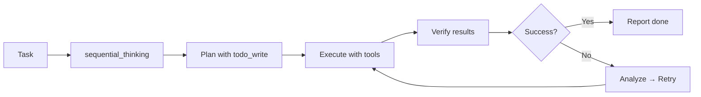
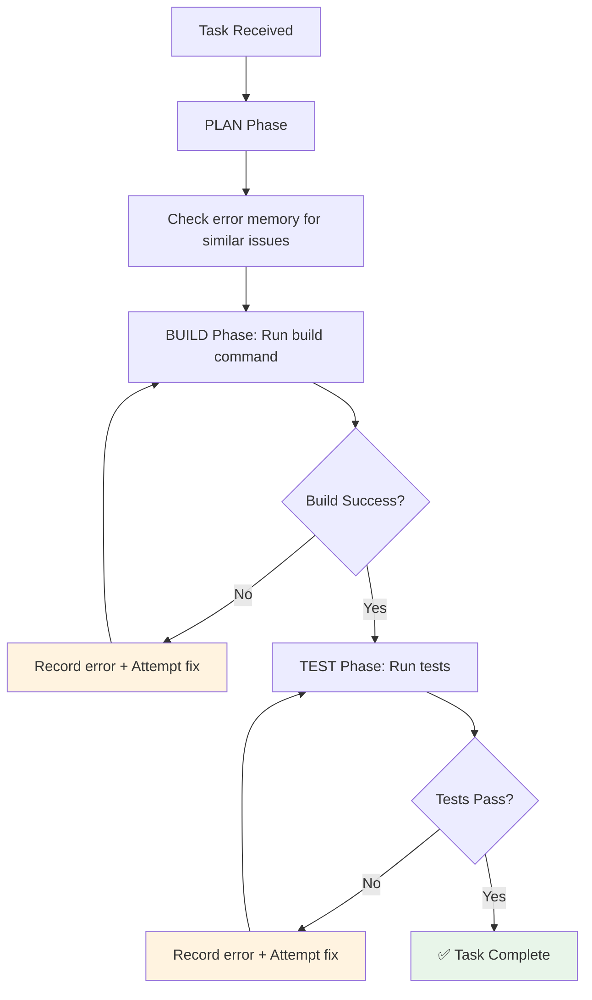
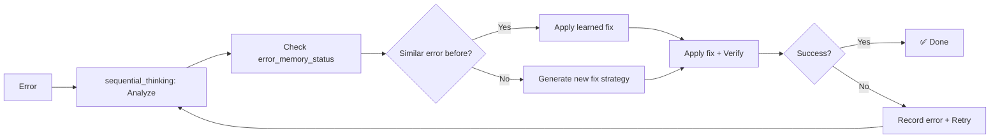

# 🧠 Qwen-Core Agent Brain Documentation

> **Purpose**: Complete reference for autonomous agents working with qwen-core  
> **Version**: 2.0.0 | **Last Updated**: 2026-05-16  
> **For**: AI agents, developers, system integrators  

---

## ⚡ Quick Start: How to Use This Agent



**Golden Rule**: NEVER explain what you'll do — USE TOOLS IMMEDIATELY.

---

## 🗂️ Core Architecture

### System Layers

```
┌─────────────────────────────────────────┐
│         qwen-studio (Electron)          │
│  ┌─────────────────────────────────┐   │
│  │  Renderer: chat.qwen.ai WebView │   │
│  │  Preload: window.electronAPI    │   │
│  └────────────┬────────────────────┘   │
│               │ IPC                    │
│  ┌────────────▼────────────┐           │
│  │  Main Process (Node.js) │           │
│  │  • MCP Proxy            │           │
│  │  • Skills Manager       │           │
│  │  • Runtime Resolver     │           │
│  └────────────┬────────────┘           │
│               │ stdio                  │
└───────────────▼────────────────────────┘
        ┌─────────────────┐
        │  qwen-core MCP  │
        │  • 39 Tools     │
        │  • 3 Prompts    │
        │  • Skills System│
        └─────────────────┘
```

### Key Files Reference

| File | Purpose | Critical For |
|------|---------|-------------|
| `qwen-core/src/index.ts` | MCP server entry, tool registry | Understanding available tools |
| `qwen-core/src/agent/AutonomousAgent.ts` | Build/test/fix cycles | Autonomous debugging |
| `qwen-core/skills/*/SKILL.md` | Workflow templates | Loading specialized behaviors |
| `src/main/mcp-config.ts` | Runtime path adaptation | Production deployment |
| `src/main/skills-manager.ts` | Skill injection into chat | UI integration |

---

## 🔧 Tool Registry (39 Tools)

### File Operations (15)
```typescript
// Read patterns
read_file({ path: "src/index.ts" })           // Full content
read_text_file({ path: "log.txt", tail: 50 }) // Last N lines
read_multiple_files({ paths: ["a.ts", "b.ts"] }) // Batch read

// Write patterns
write_file({ path: "new.ts", content: "..." }) // Creates dirs
edit_file({ path: "file.ts", oldText: "x", newText: "y" }) // Search-replace

// Directory ops
list_directory({ path: "src/" })              // Simple listing
list_directory_with_sizes({ path: "dist/", sortBy: "size" })
directory_tree({ path: ".", excludePatterns: ["node_modules"] })

// File management
create_directory({ path: "new/folder" })
move_file({ source: "old.txt", destination: "new.txt" })
delete_file({ path: "temp.txt" })             // ⚠️ Permanent
delete_directory({ path: "cache/", recursive: true })
```

### Search & Discovery (3)
```typescript
// Find files by pattern
glob_search({ pattern: "**/*.test.ts", cwd: "src/" })

// Find content by regex
grep_search({ 
  pattern: "function getUser", 
  filePattern: "*.ts",
  caseSensitive: false 
})

// Project-wide search with exclusions
search_files({ 
  path: ".", 
  pattern: "**/*.ts", 
  excludePatterns: ["node_modules", "dist"] 
})
```

### Git Operations (5)
```typescript
// Always verify before commit
git_status({ repoPath: "." })
git_diff({ repoPath: ".", staged: false })

// Commit workflow
git_add({ repoPath: ".", files: ["src/index.ts"] })
git_commit({ repoPath: ".", message: "fix: resolve null pointer" })

// History
git_log({ repoPath: ".", maxCount: 10 })
```

### Web & Research (2)
```typescript
// Fetch documentation
web_fetch({ url: "https://react.dev/reference", maxLength: 10000 })

// Search for solutions
web_search({ query: "TypeScript TS2344 fix", numResults: 10 })
```

### System & Process Control (3)
```typescript
// Execute commands (30s default timeout)
execute_command({ 
  command: "npm run build", 
  cwd: "/path/to/project",
  timeout: 60000 
})

// Process management
list_processes({ filter: "node" })
kill_process({ pid: 12345 })  // ⚠️ Verify PID first!
```

### Time Operations (2)
```typescript
// Get current time
get_current_time({ timezone: "Africa/Cairo" })

// Convert between timezones
convert_time({ 
  sourceTimezone: "Africa/Cairo", 
  time: "14:00", 
  targetTimezone: "America/New_York" 
})
```

### PDF Processing (1)
```typescript
read_pdf({ 
  path: "docs/spec.pdf",
  pages: "1-5,10",
  includeText: true,
  includeMetadata: true,
  includeImages: false 
})
```

### Agent Intelligence (3)
```typescript
// Structured reasoning (MANDATORY before complex actions)
sequential_thinking({
  thought: "First, I need to understand the codebase",
  thoughtNumber: 1,
  totalThoughts: 5,
  nextThoughtNeeded: true
  // Optional: isRevision, branchFromThought, branchId
})

// Task tracking
todo_write({
  todos: [
    { content: "Read main module", status: "pending" },
    { content: "Identify issues", status: "pending" },
    { content: "Fix bugs", status: "pending" }
  ]
})

// Clarify ambiguity
ask_user({ question: "Should I create a new file or modify existing?" })
```

### Skills System (3)
```typescript
// Discover available skills
list_skills({})

// Load skill instructions into context
load_skill({ name: "tdd" })  // Checks ~/.agents/skills/, ./skills/, ./.qwen/skills/

// Get skill metadata
skill_info({ name: "git" })
```

### Autonomous Agent (3)
```typescript
// Execute build/test/fix cycles
autonomous_agent({
  task: "Fix failing unit tests in src/",
  workspaceRoot: "/path/to/project",
  buildCommand: "npm run build",
  testCommand: "npm test",
  maxIterations: 10  // 1-50
})

// Review learned errors
error_memory_status({})

// Reset agent memory
clear_error_memory({})
```

---

## 🧠 Autonomous Agent Protocol

### How It Works



### Error Memory System

**Never repeats failed fixes** — tracks what was tried:

```typescript
interface ErrorRecord {
  error: string;           // Error message
  timestamp: number;       // When it occurred
  context: string;         // Build/test context
  fixAttempted: boolean;   // Was a fix tried?
  fixSuccessful?: boolean; // Did the fix work?
  learnings: string[];     // Key insights
}
```

**Usage Pattern**:
```typescript
// Before debugging: check what's been tried
error_memory_status({})  // Returns: "Error Memory: 3 total, 1 fixed, 2 unresolved"

// If stuck: reset memory for fresh approach
clear_error_memory({})

// Let agent handle iterative fixes
autonomous_agent({
  task: "Debug TypeError in API handler",
  maxIterations: 15  // Higher for complex bugs
})
```

---

## 🎯 Execution Workflow (MANDATORY)

### Phase 1: SEARCH → Understand Context

```typescript
// 1. Find relevant files
glob_search({ pattern: "**/*auth*.ts" })

// 2. Read existing implementations
read_file({ path: "src/auth.ts" })

// 3. Search for patterns/issues
grep_search({ 
  pattern: "TODO|FIXME|BUG|error", 
  filePattern: "*.ts" 
})

// 4. Check architecture docs
read_file({ path: "docs/ARCHITECTURE.md" })
```

### Phase 2: PLAN → Create Actionable Steps

```typescript
// Use sequential_thinking for complex decisions
sequential_thinking({
  thought: "Identifying root cause of auth failure",
  thoughtNumber: 1,
  totalThoughts: 4,
  nextThoughtNeeded: true
})

// Track progress with todos
todo_write({
  todos: [
    { content: "Read auth module", status: "done" },
    { content: "Identify null check missing", status: "in_progress" },
    { content: "Add null validation", status: "pending" },
    { content: "Test the fix", status: "pending" }
  ]
})
```

### Phase 3: EXECUTE → Use Tools Immediately

```typescript
// ⚠️ NEVER just describe — CALL THE TOOL

// Bad: "I would edit the file to add a null check"
// Good:
edit_file({
  path: "src/auth.ts",
  oldText: "if (user) {",
  newText: "if (user && user.id) {"
})

// Verify immediately
read_file({ path: "src/auth.ts" })  // Confirm change applied
```

### Phase 4: VERIFY → Check Results

```typescript
// Type check
execute_command({ command: "npm run typecheck" })

// Run tests
execute_command({ command: "npm test" })

// Git review before commit
git_diff({ repoPath: "." })
git_status({ repoPath: "." })

// Only then commit
git_add({ repoPath: ".", files: ["src/auth.ts"] })
git_commit({ 
  repoPath: ".", 
  message: "fix: add null check for user.id in auth" 
})
```

---

## 🔐 Safety & Security Rules

### File Operations
```typescript
// ALWAYS read before editing
read_file({ path: "config.json" })  // Verify exists + content
edit_file({ ... })                  // Then edit

// NEVER delete without verification
get_file_info({ path: "important.txt" })  // Check size, dates
list_directory({ path: "src/" })          // Confirm location
delete_file({ path: "important.txt" })    // Only after verification

// Use move_file for safer "deletion"
move_file({ 
  source: "old-feature.ts", 
  destination: "archive/old-feature.ts" 
})
```

### Git Operations
```typescript
// Required workflow
git_status({ repoPath: "." })      // 1. See what changed
git_diff({ repoPath: "." })        // 2. Review changes
// ... make changes ...
git_diff({ repoPath: ".", staged: true })  // 3. Review staged
git_commit({ repoPath: ".", message: "feat: ..." })  // 4. Commit
```

### System Commands
```typescript
// Always set cwd and timeout
execute_command({
  command: "dangerous-command",
  cwd: "/specific/project",  // Prevent accidental system-wide changes
  timeout: 30000             // Prevent hanging
})

// Verify process before killing
list_processes({ filter: "my-app" })  // Find PID
kill_process({ pid: 12345 })          // Only after verification
```

---

## 🧩 Skills System

### Skill Loading Order
```
1. ~/.agents/skills/{name}/SKILL.md  (Global)
2. ./skills/{name}/SKILL.md          (Project)
3. ./.qwen/skills/{name}/SKILL.md    (Alternative)
```

### Available Core Skills

| Skill | Purpose | When to Use |
|-------|---------|------------|
| `tdd` | Test-Driven Development | Writing new features |
| `git` | Git best practices | Version control tasks |
| `security-review` | Security auditing | Before deployment |
| `frontend-design` | UI/UX patterns | Building interfaces |
| `optimize` | Performance tuning | Slow code paths |
| `audit` | Code quality review | Before PRs |

### Loading a Skill
```typescript
// Method 1: Tool call
load_skill({ name: "tdd" })

// Method 2: Via prompt
// System will auto-inject skill content into context

// Verify loaded
skill_info({ name: "tdd" })
// Returns: source, hash, added date
```

### Creating a New Skill
```markdown
# File: skills/my-skill/SKILL.md

name: my-skill
description: "What this skill does"
triggers: ["keyword1", "keyword2"]

## Instructions
- Step 1: Do this
- Step 2: Then that
- Step 3: Verify result

## Examples
Example usage here

## Related Tools
- tool1: For X
- tool2: For Y
```

---

## 🐛 Debugging Protocol

### When Something Fails



### Common Error Patterns & Fixes

| Error Pattern | Likely Cause | Fix Strategy |
|--------------|-------------|-------------|
| `Cannot find module` | Missing dependency | `execute_command({ command: "npm install <pkg>" })` |
| `TS2304: Cannot find name` | Missing import | `grep_search` for definition → `edit_file` to add import |
| `Test timeout` | Async issue | Increase timeout or fix promise handling |
| `git: not a repository` | Wrong cwd | Set `repoPath` or `cwd` correctly |
| `Permission denied` | File locked | Check `get_file_info` permissions |

### Max Effort Debugging
```typescript
// Enable comprehensive analysis
autonomous_agent({
  task: "Debug complex issue",
  enableMaxEffort: true,  // Default: true
  maxIterations: 20       // Higher for tough bugs
})
```

**Max Effort does**:
- Runs comprehensive code analysis
- Searches codebase for similar issues
- Reviews git history for recent changes
- Uses multiple debugging strategies
- Never gives up until all options exhausted

---

## 📦 Production Deployment Notes

### Runtime Path Resolution

**Development vs Production paths**:

```typescript
// In src/main/runtime.ts
export function getBunPath(): string {
  if (process.env.NODE_ENV === 'development') {
    return 'resources/bun/linux-x64/bun';
  }
  // Production: bundled in ASAR
  return path.join(process.resourcesPath, 'resources/bun/linux-x64/bun');
}
```

**Always use these helpers**:
- `getBunPath()` — Bun runtime location
- `getUvxPath()` — UV Python manager
- `getQwenCorePath()` — qwen-core server path

### MCP Configuration Format

```json
{
  "mcpServers": {
    "qwen-core": {
      "command": "/path/to/bun",
      "args": ["run", "/path/to/qwen-core/src/index.ts"],
      "cwd": "/path/to/qwen-core",
      "env": {
        "MCP_ALLOWED_DIRS": "/home/user,/tmp",
        "MCP_TIMEOUT": "60000"
      },
      "transportType": "stdio"
    }
  }
}
```

**Security**: `MCP_ALLOWED_DIRS` restricts file tool access — do not expand without user consent.

---

## 🎨 Visual Cues for ADHD Optimization

### Use These Patterns

```markdown
✅ Success indicators
⚠️ Warnings/cautions
❌ Errors/failures
🔄 Iteration markers
📋 Task lists
🔧 Fix attempts
🧪 Test results
🚀 Completion markers
```

### Message Structure

```
🎯 [Phase] Brief description
• Key point 1
• Key point 2
✅ Result or next action
```

**Example**:
```
🔧 [Fix Attempt 2/5] Adding null check
• Modified: src/auth.ts:42
• Added: user?.id validation
✅ Change applied — running tests...
```

---

## 🚫 Critical DON'Ts

```typescript
// ❌ NEVER do this:
// Just explaining without acting
"I can help with that by editing the file..."

// ✅ ALWAYS do this:
// Use the tool immediately
edit_file({ path: "file.ts", oldText: "...", newText: "..." })
```

```typescript
// ❌ NEVER assume file content
// Always read first
read_file({ path: "config.json" })  // Required before edit
```

```typescript
// ❌ NEVER hardcode paths
const path = "/home/user/project"  // Brittle!

// ✅ Use parameters or helpers
const path = process.cwd()  // Or get from args
```

```typescript
// ❌ NEVER skip verification
edit_file({...})  // Done!

// ✅ Always verify
edit_file({...})
read_file({...})  // Confirm change
execute_command({ command: "npm run typecheck" })  // Validate
```

---

## 📞 When Stuck: Escalation Protocol

### Step 1: Self-Correction (3 attempts max)
```typescript
// Analyze with sequential_thinking
sequential_thinking({
  thought: "Why is this failing? Let me check...",
  thoughtNumber: 1,
  totalThoughts: 3,
  nextThoughtNeeded: true
})

// Try alternative approach
// Update todos with new plan
todo_write({...})
```

### Step 2: Ask for Clarification
```typescript
ask_user({
  question: "Found 3 possible fixes for the auth error. Which approach do you prefer:\n1. Add null check\n2. Update type definitions\n3. Refactor the validation logic"
})
```

### Step 3: Report with Options
```markdown
🚨 [Blocked] Cannot proceed without input

**Issue**: Auth module has circular dependency
**Attempts**: 
1. ✅ Read all auth files
2. ✅ Identified circular import: auth.ts ↔ user.ts
3. ❌ Cannot break cycle without architecture decision

**Options**:
A. Extract shared types to `shared/auth-types.ts`
B. Use lazy import pattern
C. Refactor auth into separate module

**Recommendation**: Option A (minimal changes)

Awaiting your decision to proceed.
```

---

## ✅ Agent Completion Checklist

Before reporting task done:

- [ ] **Searched**: Used `glob`/`grep`/`read` to understand context
- [ ] **Planned**: Listed steps with `todo_write` + `sequential_thinking`
- [ ] **Executed**: Used tools (not just described actions)
- [ ] **Verified**: Ran typecheck/tests/git diff
- [ ] **Committed**: Git changes with conventional message (if applicable)
- [ ] **Documented**: Updated README/docs if architecture changed
- [ ] **Reported**: Clear summary with file:line references

---

## 🔄 Quick Reference: Tool Selection Guide

| Goal | Primary Tool | Supporting Tools |
|------|-------------|-----------------|
| Read a file | `read_file` | `get_file_info` (verify first) |
| Edit code | `edit_file` | `read_file` → `edit_file` → `read_file` |
| Find files | `glob_search` | `read_file` to examine matches |
| Find code patterns | `grep_search` | `glob_search` to narrow scope |
| Run build/test | `execute_command` | `autonomous_agent` for cycles |
| Git workflow | `git_status` → `git_diff` → `git_add` → `git_commit` | `git_log` for history |
| Research | `web_search` → `web_fetch` | `write_file` to save findings |
| Complex planning | `sequential_thinking` | `todo_write` to track |
| Debug iteratively | `autonomous_agent` | `error_memory_status` to review |
| Load workflow | `load_skill` | `list_skills` to discover |

---

## 🎯 Remember: The Agent Mantra

```
🧠 THINK → 📋 PLAN → 🔧 ACT (TOOLS) → 👁️ OBSERVE → 🔄 CORRECT
```

**Every task follows this loop**. Never skip phases.

**Tools are your hands** — use them constantly.  
**No tool call = task not started**.  
**Users want results, not explanations of how you'd get results**.

---

*Document generated for qwen-core v2.0.0 • For autonomous agent use • Keep this reference handy* 🚀
