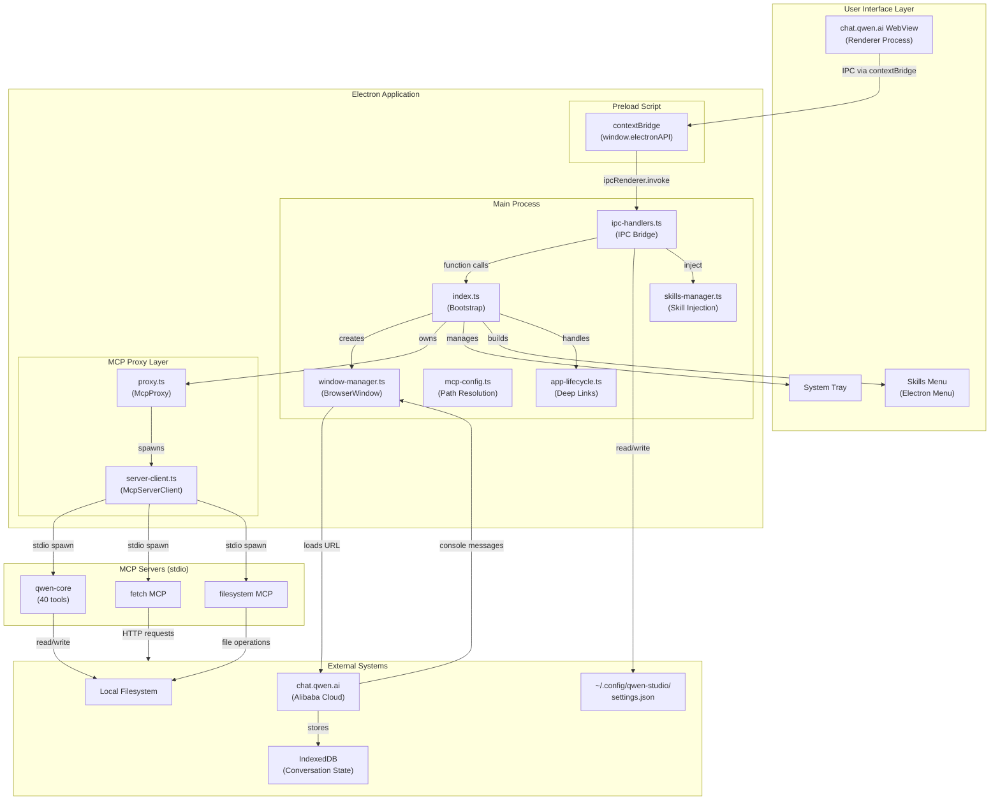
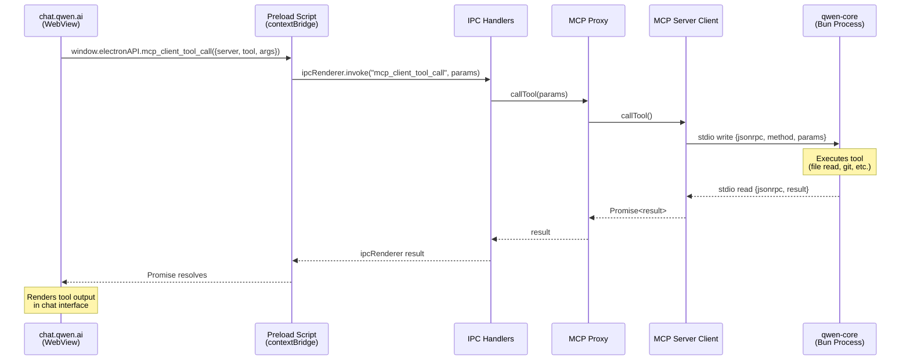
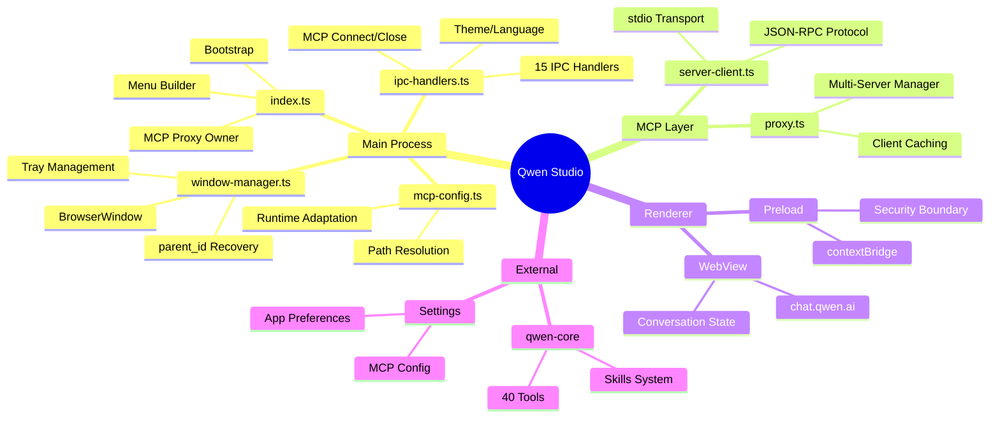
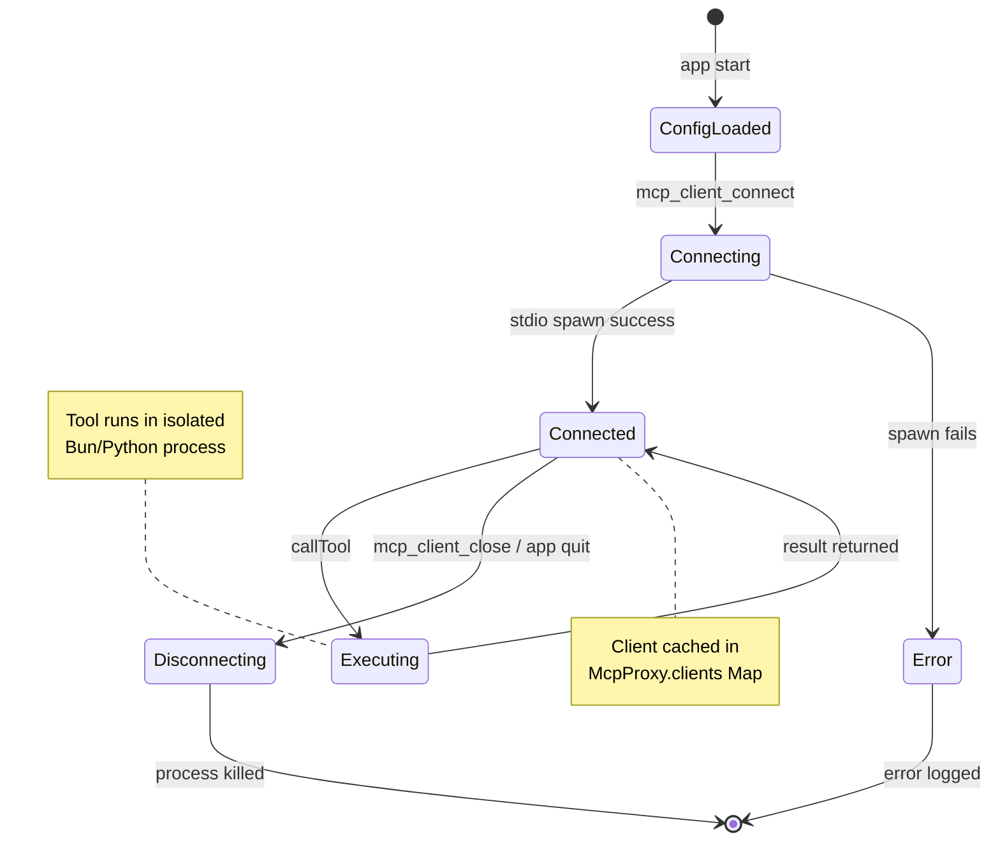
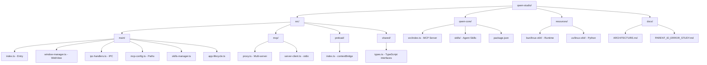
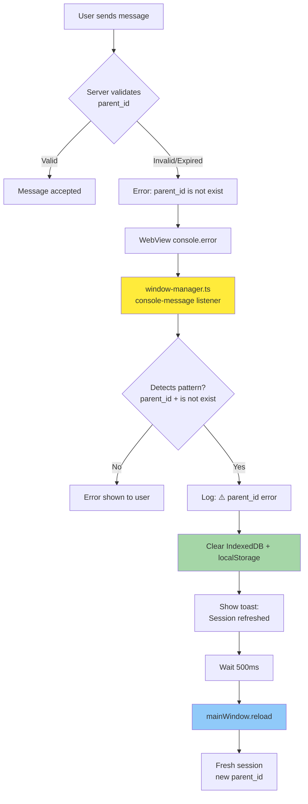
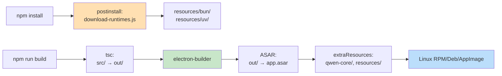
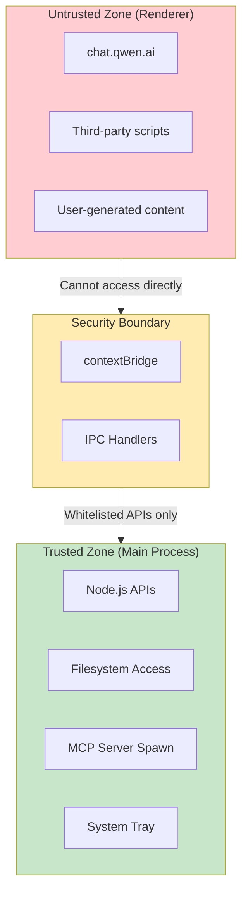

# Qwen Studio Architecture

## System Overview



## Data Flow: MCP Tool Execution



## Component Responsibilities



## Process Architecture

```mermaid
flowchart LR
    subgraph P1["Process 1: Main (Node.js)"]
        M1[Electron Main]
        M2[MCP Proxy]
        M3[IPC Handlers]
    end

    subgraph P2["Process 2: Renderer (Chromium)"]
        R1[WebView - chat.qwen.ai]
        R2[Preload Script]
    end

    subgraph P3["Process 3-N: MCP Servers"]
        S1[qwen-core (Bun)]
        S2[fetch (UV/Python)]
        S3[filesystem (UV/Python)]
    end

    P1 <-->|IPC Bridge| P2
    P1 <-->|stdio JSON-RPC| P3
    
    style P1 fill:#e1f5ff
    style P2 fill:#fff4e1
    style P3 fill:#e8f5e9
```

## MCP Server Lifecycle



## File Structure Map



## IPC Channel Map

| Channel | Direction | Handler | Purpose |
|---------|-----------|---------|---------|
| `get_app_version` | Renderer → Main | `ipc-handlers.ts:41` | Get app version |
| `get_platform_info` | Renderer → Main | `ipc-handlers.ts:45` | Get OS/arch |
| `open_devtool` | Renderer → Main | `ipc-handlers.ts:56` | Open DevTools |
| `mcp_client_connect` | Renderer → Main | `ipc-handlers.ts:121` | Connect MCP servers |
| `mcp_client_tool_list` | Renderer → Main | `ipc-handlers.ts:165` | List available tools |
| `mcp_client_tool_call` | Renderer → Main | `ipc-handlers.ts:186` | Execute tool |
| `mcp_client_update_config` | Renderer → Main | `ipc-handlers.ts:203` | Update MCP config |
| `switch_theme` | Renderer → Main | `ipc-handlers.ts:278` | Toggle dark/light |
| `event_to_main` | Renderer → Main | `ipc-handlers.ts:305` | Custom events |
| `event_from_main` | Main → Renderer | `preload.ts:97` | Event broadcast |

## Key Design Decisions

### 1. Electron Wrapper Pattern
**Decision:** Wrap chat.qwen.ai instead of building native chat UI

**Why:**
- Leverages Alibaba's continuous web app improvements
- No need to implement chat rendering, message history, account management
- Focus on desktop integration (MCP, filesystem, system tray)

**Trade-off:** Cannot modify chat UI behavior; dependent on web app stability

### 2. MCP Proxy Architecture
**Decision:** Single `McpProxy` class managing multiple server connections

**Why:**
- Unified API for renderer (`mcp_client_tool_call`)
- Client caching reduces spawn overhead
- Lazy connection model (connect on first tool call)

**Implementation:** `src/mcp/proxy.ts` - 268 lines

### 3. stdio Transport for MCP
**Decision:** Use stdio JSON-RPC instead of HTTP/SSE for local servers

**Why:**
- No network overhead
- Automatic cleanup on process exit
- Simpler security model (no open ports)

**Protocol:** JSON-RPC 2.0 over stdin/stdout

### 4. Context Isolation
**Decision:** Enable `contextIsolation: true` with preload script

**Why:**
- Security: renderer cannot access Node.js directly
- Clean API boundary via `window.electronAPI`
- Prevents renderer from spawning arbitrary processes

### 5. qwen-core Embedding
**Decision:** Bundle qwen-core inside app.asar, not as external dependency

**Why:**
- Single install (no separate npm install for user)
- Version locked to app version
- Path resolution via `process.resourcesPath`

**Location:** `resources/app.asar/qwen-core/src/index.ts`

## Error Recovery: parent_id Flow



## Build Pipeline



## Configuration Storage

| Config | Location | Format | Managed By |
|--------|----------|--------|------------|
| MCP Servers | `~/.config/qwen-studio/settings.json` | `{ mcpServers: {...} }` | IPC handlers |
| App Theme | Web app account settings | Server-side | chat.qwen.ai |
| Language | `~/.config/qwen-studio/settings.json` | `{ app_language: "en" }` | IPC handlers |
| Conversation State | IndexedDB (LevelDB) | Binary (Leveldb) | chat.qwen.ai |
| Skills | `~/.config/qwen-studio/skills/` | Markdown files | skills-manager.ts |

## Security Boundaries



---

**Generated:** 2026-05-15  
**Version:** qwen-studio v2.1.0
